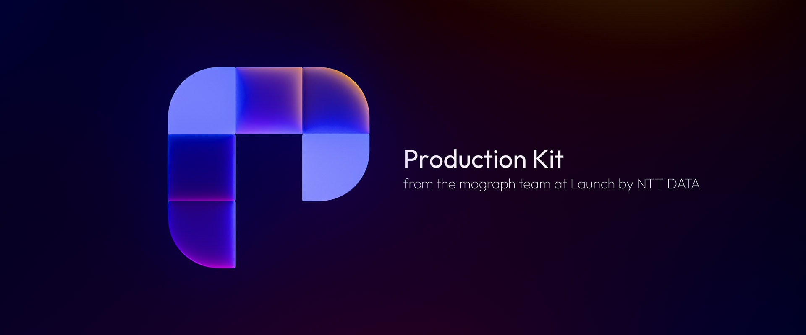
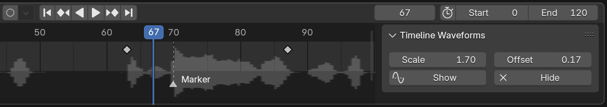
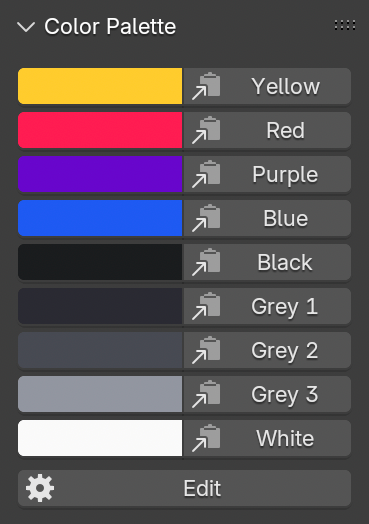
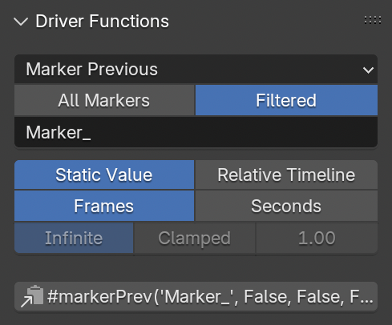
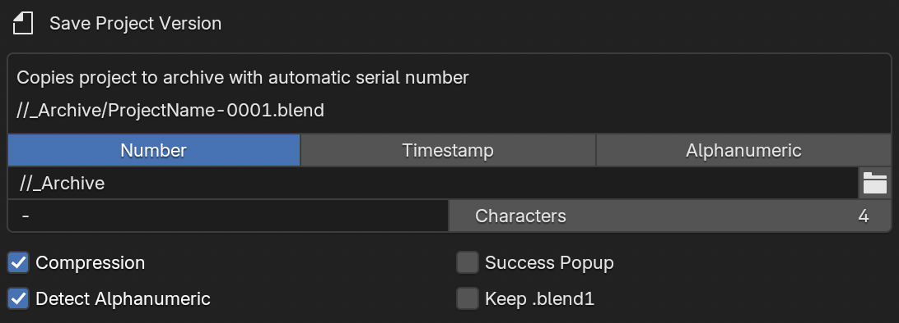
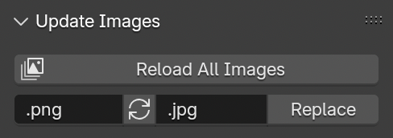
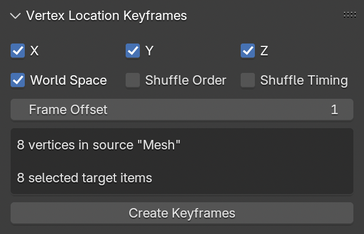
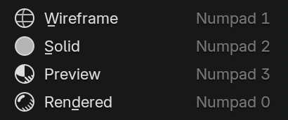

# Launch Production Kit — General Blender Utilities

## Features:

- ### Audio Waveforms

  - Renders audio clips from the Sequencer as waveforms in the Dope Sheet and Timeline views (requires local [FFmpeg](https://ffmpeg.org/) installation feature is disabled if not set in the preferences)
  
    
  
- ### BPM Overlay

  - Draws beat and measure markers over the Dope Sheet and Timeline, with configurable BPM, time signature, colors, shapes, and offset (makes animating to music _much_ easier)

- ### Color Palette

  - Creates a color palette in the 3D Viewport sidebar using plain text storage for easy transport

    

- ### Cycle Transforms

  - Adds a *Cycle Item Transforms* command to the Object > Transform menu that switches the location, rotation, and scale values for two or more selected objects

- ### Driver Functions

  - Adds custom value drivers and a GUI for setting them up, including timeline values based on markers, random, wiggle, and curve-at-time functions
  - Procedural easing with both in/out and inverted easing for a wide variety of applications (easing functions are adapted from the work of [Robert Penner](https://easings.net/))

    

- ### Project Versioning

  - Quick shortcuts for saving numbered project files in an archive location

    

- ### Transfer to Scene

  - Adds *Move to Scene*, *Copy to Scene*, and *Link to Scene* submenus to the Outliner context menu for moving, duplicating, or linking selected objects and collections between scenes

- ### Update Images

  - Update all images from the node editor sidebar, automatically change settings based on file name patterns, and change file sources with text based find and replace

    

- ### Vertex Location Keyframes

  - Adds keyframes to objects using the vertex positions from a selected mesh

    

- ### Viewport Shading

  - Adds viewport shading options to the View menu along with number pad shortcuts

    

## Installation via Extensions Platform:

- Go to Blender Preferences > Get Extensions > Repositories > **＋** > Add Remote Repository
- Set the URL to `https://jeinselen.github.io/Launch-Blender-Extensions/index.json`
- Enable `Check for Updates on Start`
- Filter the available extensions for "Launch" and install as needed

## Installation via Drag-and-Drop:

- Click and drag one of the file links from the [repository list page](https://jeinselen.github.io/Launch-Blender-Extensions/) into Blender

## Installation via Download:

- Download the extension .zip
- Drag-and-drop the file into Blender

These latter two methods will not connect to the centralised repository here on GitHub and updates will not be automatically available. If you don't need easy updates, don't want GitHub servers to be pinged when you start up Blender, or would just like to try some extensions without adding yet another repository to your Blender settings, this is the option for you.

## Notes:

Software is provided as-is with no warranty or provision of suitability. These are internal tools and are shared because we want to support an open community. Bug reports are welcomed, but we cannot commit to fixing or adding features. Not all features may be actively maintained, as they're updated on an as-needed basis.
