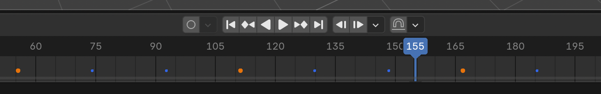
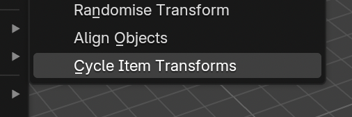
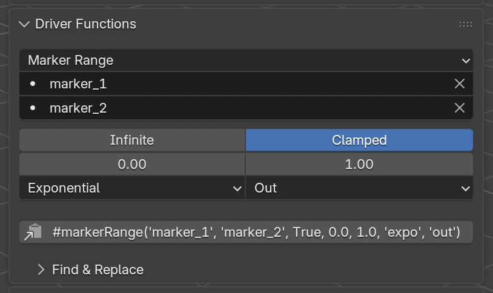
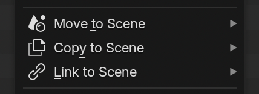

# Launch Production Kit — General Blender Utilities

## Features:

- ### Audio Waveforms

  - Renders audio clips from the Sequencer as waveforms in the Dope Sheet and Timeline views (requires local [FFmpeg](https://ffmpeg.org/) installation feature is disabled if not set in the preferences)
  
    
  
- ### BPM Overlay

  - Draws beat and measure markers over the Dope Sheet and Timeline, with configurable BPM, time signature, colors, shapes, and offset (makes animating to music _much_ easier)

    

- ### Color Palette

  - Creates a color palette in the 3D Viewport sidebar using plain text storage for easy transport

    

- ### Cycle Transforms

  - Adds a *Cycle Item Transforms* command to the Object > Transform menu that switches the location, rotation, and scale values for two or more selected objects

    

- ### Driver Functions

  - Adds custom value drivers and a GUI for setting them up more easily

    - `curveAtTime('Cube', 0, frame-10)`
      - Object name, animation channel, sample time (shown above is a 10 frame delay)
    - `ease(frame/60, 'inv_cubic', 'inout')`
      - Input value (expects range 0-1), interpolation type, easing (in, out, inout)
      - Easing functions adapted from the work of [Robert Penner](https://easings.net/)
    - `hash('{project}')`
      - Generates hash value based on input string (often useful for changing seed values, supports variables {project}, {scene}, and {viewlayer})
    - `lerp(0.0, 1.0, 0.5)`
      - Value A, value B, linear mix between them (expects range 0-1)
    - `markerValue('marker_1', True, True, True, 2.0, 0.0, 1.0, 'inv_cubic', 'inout')`
      - Gets the frame value or relative timeline of the first marker that matches the string by name
      - Required: marker name
      - Optional: static or relative time, frames or seconds, infinite or clamped, clamped duration in seconds, start value, end value, interpolation type, easing (in, out, inout)
    - `markerPrev('marker_', True, True, True, 2.0, 0.0, 1.0, 'inv_cubic', 'inout')`
      - Gets the frame value or relative timeline of the closest marker at or before the current time
      - Optional: filter by string content (any name if empty), static or relative time, frames or seconds, infinite or clamped range, clamped duration in seconds, start value, end value, interpolation type, easing (in, out, inout)
    - `markerNext('marker_', True, True, True, 2.0, 0.0, 1.0, 'inv_cubic', 'inout')`
      - Gets the frame value or relative timeline of the closest marker at or before the current time
      - Optional: filter by string content (any name if empty), static or relative time, frames or seconds, infinite or clamped range, clamped duration in seconds, start value, end value, interpolation type, easing (in, out, inout)
    - `markerRange('marker_1', 'marker_2', True, 0.0, 1.0, 'inv_cubic', 'inout')`
      - Returns a value scaled between two markers in the timeline
      - Required: starting marker, ending marker
      - Optional: infinite or clamped range, start value, end value, interpolation type, easing (in, out, inout)
    - `markerMatch(self, 'collection', 0.0, 1.0)`
      - Returns a value if the nearest marker at or before the current time matches the name of the item or its collections (super helpful for using markers to define timeline segments)
      - Required: self
        - `Use Self` _must_ be enabled in the driver panel or the driver will fail
        - Use the context menu on property fields to `Add Marker Match Driver` to automatically use the settings in this panel to apply a properly set up driver with `Use Self` enabled (copying the driver text is still possible, but cannot toggle the appropriate setting)
      - Optional: name source (item, collection, or collections), value A (marker and name match false), value B (marker and name match true)
    - `random(0.0, 1.0, frame)`
      - Returns a random value within the specified range based on input seed
      - Required: value A (range minimum), value B (range maximum), seed (any float value)
    - `wiggle(2.0, 1.0, 3.0, 5.0)`
      - Over time returns an interpolating value within an amplitude range (-/+)
      - Required: frequency (speed of the value changes), amplitude (value range), octaves (number of overlaid frequencies, noise detail), seed (any float value)

    

- ### Project Versioning

  - Quick shortcuts for saving numbered project files in an archive location

    

- ### Transfer to Scene

  - Adds *Move to Scene*, *Copy to Scene*, and *Link to Scene* submenus to the Outliner context menu for moving, duplicating, or linking selected objects and collections between scenes

    

- ### Update Images

  - Update all images from the node editor sidebar, automatically change settings based on file name patterns, and change file sources with text based find and replace

    

- ### Vertex Location Keyframes

  - Adds keyframes to items using the vertex positions of a selected mesh

    

- ### Viewport Shading

  - Adds viewport shading options to the View menu along with number pad shortcuts

    

## Installation via Extensions Platform:

- Go to Blender Preferences > Get Extensions > Repositories > **＋** > Add Remote Repository
- Set the URL to `https://jeinselen.github.io/Launch-Blender-Extensions/index.json`
- Enable `Check for Updates on Start`
- Filter the available extensions for "Launch" and install as needed

## Installation via Drag-and-Drop:

- Click and drag one of the file links from the [repository list page](https://jeinselen.github.io/Launch-Blender-Extensions/) into Blender

## Installation via Download:

- Download the extension .zip
- Drag-and-drop the file into Blender

These latter two methods will not connect to the centralised repository here on GitHub and updates will not be automatically available. If you don't need easy updates, don't want GitHub servers to be pinged when you start up Blender, or would just like to try some extensions without adding yet another repository to your Blender settings, this is the option for you.

## Notes:

Software is provided as-is with no warranty or provision of suitability. These are internal tools and are shared because we want to support an open community. Bug reports are welcomed, but we cannot commit to fixing or adding features. Not all features may be actively maintained, as they're updated on an as-needed basis.
