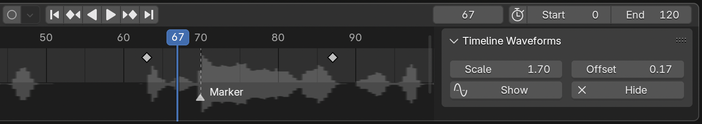
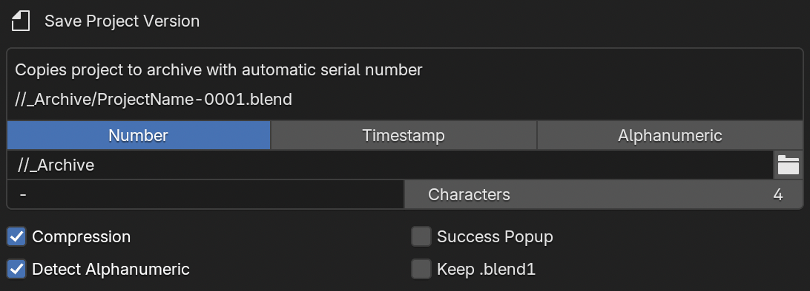

# Launch Production Kit — General Blender Utilities

## Features:

- ### Audio Waveforms

  - Renders audio clips from the Sequencer as waveforms in the general Timeline view

    

- ### Color Palette

  - Creates a color palette in the 3D Viewport sidebar using plain text storage for easy transport

    

- ### Driver Functions

  - Adds custom value drivers and a GUI for setting them up, including timeline values based on markers, random, wiggle, and curve-at-time functions

    

- ### Project Versioning

  - Quick shortcuts for saving numbered project files in an archive location

    

- ### Update Images

  - Update all images from the node editor sidebar, automatically change settings based on file name patterns, and change file sources with text based find and replace

    

- ### Vertex Location Keyframes

  - Adds keyframes to objects using the vertex positions from a selected mesh

    

- ### Viewport Shading

  - Adds viewport shading options to the View menu along with number pad shortcuts

    

## Installation via Extensions Platform:

- Go to Blender Preferences > Get Extensions > Repositories > **＋** > Add Remote Repository
- Set the URL to `https://jeinselen.github.io/Launch-Blender-Extensions/index.json`
- Set the local directory if desired (relative paths seem to fail, try absolute instead)
- Enable `Check for Updates on Start`
- Filter the available extensions for "Launch" and install as needed

## Installation via Download:

- Download the .zip file for a specific kit
- Drag-and-drop the file into Blender

This method will not connect to the centralised repository here on GitHub and updates will not be automatically available. If you don't need easy updates, don't want GitHub servers to be pinged when you start up Blender, or would just like to try some extensions without adding yet another repository to your Blender settings, this is the option for you.

## Notes:

Software is provided as-is with no warranty or provision of suitability. These are internal tools and are shared because we want to support an open community. Bug reports are welcomed, but we cannot commit to fixing or adding features. Not all features may be actively maintained, as they're updated on an as-needed basis.
